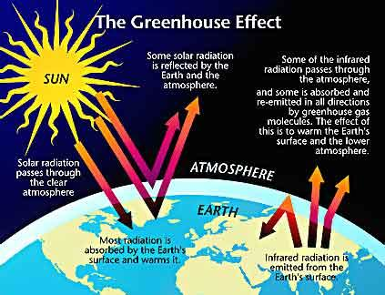
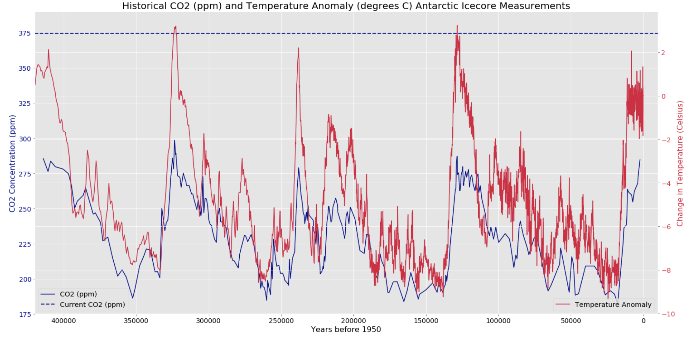
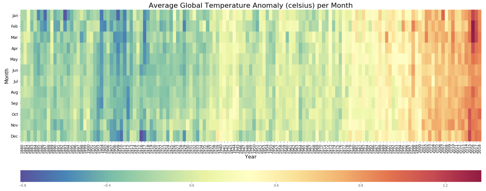
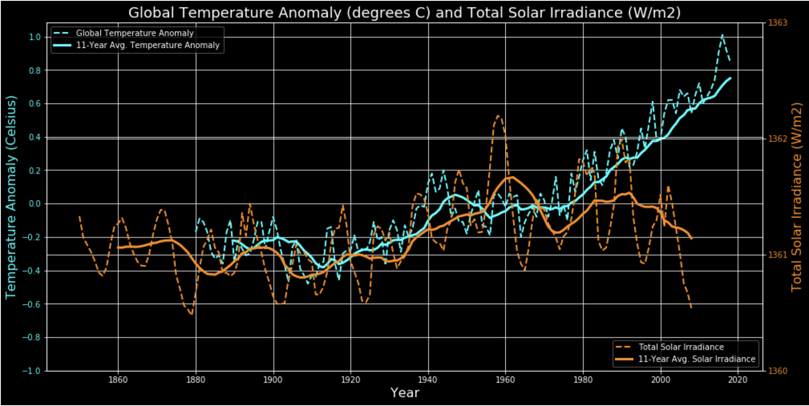
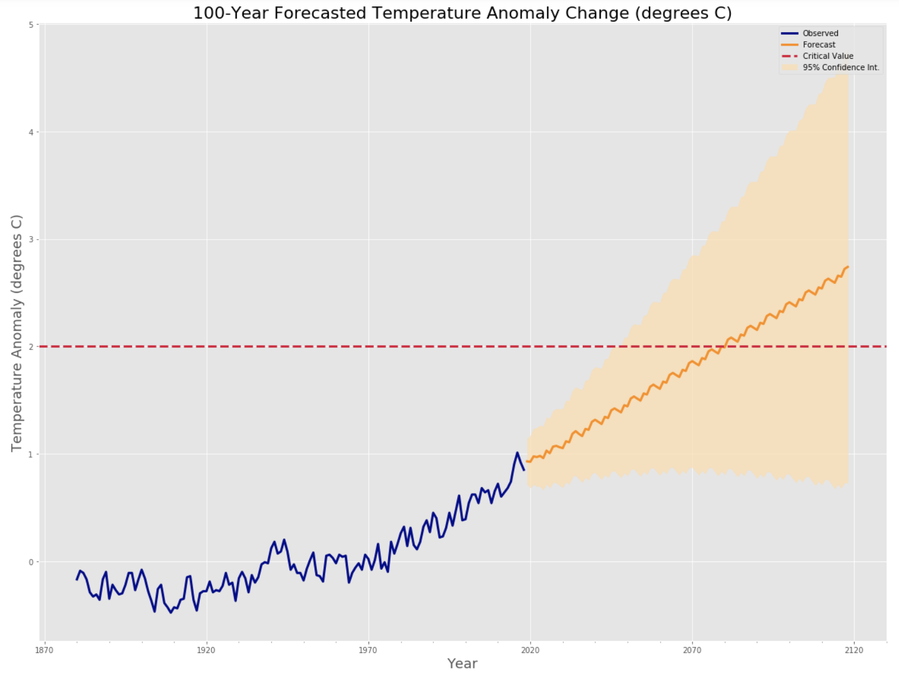
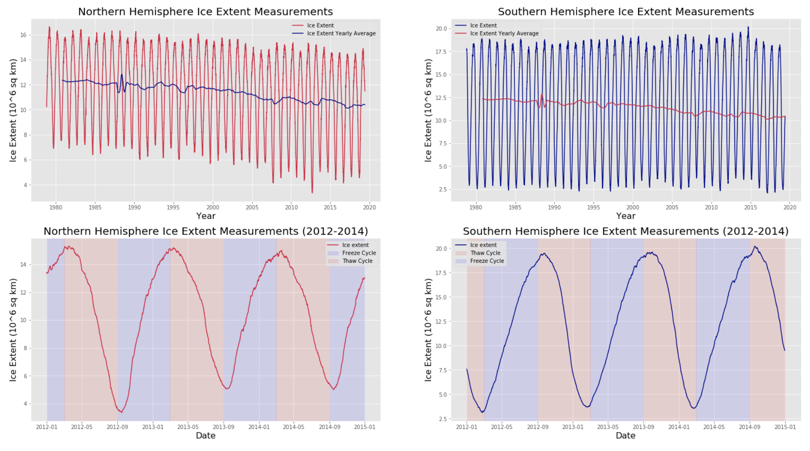
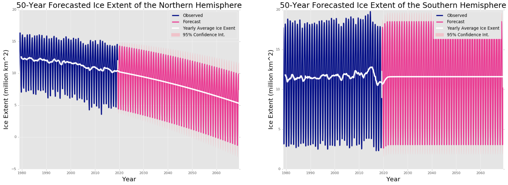
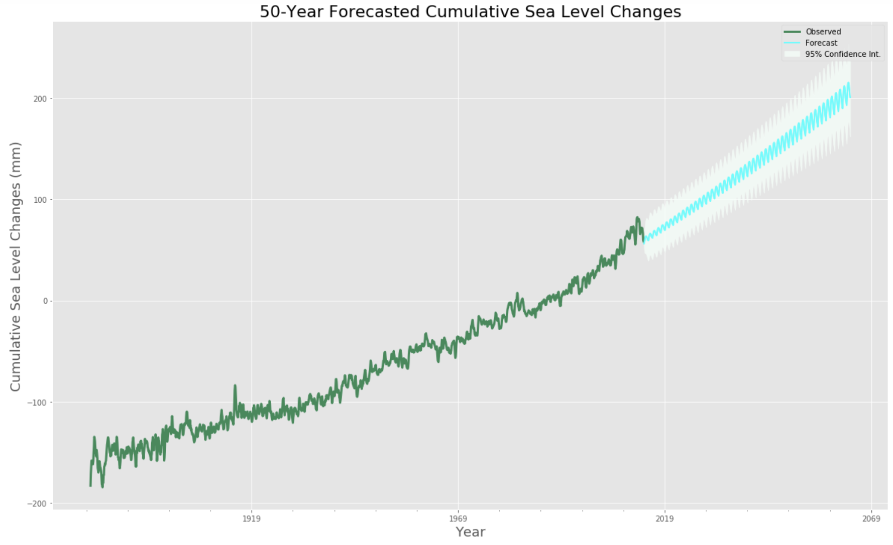

# Global Warming and Climate Change

Global warming and climate change are growing threats to the existance of our species on Earth. While these two terms are used interchangibly, global warming is only referring to the change in global temperatures, where climate change involves the change in global temperatures along with the effects of this change. Eventhough a majority of the scientific community is in consensus about the existence of global warming, its causes, and its threat to humanity, there are many people that deny this reality. The aim of this project is to explore the data surounding global warming and its effects to bring awareness to this impending global crisis and to aid in conversations regarding mitigative efforts and solutions.

## Causes

Rising levels of atmospheric greenhouse gases resulting from the advent of the Industrial Revolution (1760 - 1820) and perpetuated by modern industrial society have created a dangerous environment where it is becoming more difficult for the planet to cool itself. Under normal conditions, the Earth is able to radiate excess heat into space in the form of infrared radiation. However, the increased concentration of greenhouse gases in the atmosphere absorb this radiant energy and prevent its release into space, causing an increase in temperature of the lower atmosphere and surface air.

Climate scientists urge immediate action on this greenhouse gas effect described above as many estimates suggest that if the average global temperature were to increase by +2.0 degrees C, Earth would enter a hothouse climate state. In this state, not only would the planet be unable to cool itself through natural processes, it would induce self-reinforcing feedbacks that would actually contribute to warming the planet further. In essence, as the planet warms, the ice caps and snow packs would melt. As the ice caps and snow packs melt, the Earth's ability to reflect radiant energy from the sun decreases, resulting in a further increase in temperatures. Additionally, the melting ice caps and snow packs would end up increasing global sea levels, dramatically reducing the inhabital land mass of the continents.

Milankovitch Cycles relate to the changes in the tilt of the Earth's axis and variations in its orbit around the sun. These variations do contribute to global temperature changes and periods of glaciation, but they occur over tens of thousands years. The graph below illustrates these temperature changes over the past 420,000 years along with atmospherice concentrations of carbon dioxide, the most prevalent greenhouse gas. The dotted line along the top of the graph displays the 2004 atmospheric concentration of carbon dioxide. This graphic displays why climate scientists are so concerned about the average global temperature change reaching the +2.0 degrees C critial value. While Earth has reached this critial value in the past, it has never been hit while the concentration of atmospheric greenhouses have been as high as we have today.

## Evidence for Global Warming

The warming trend that has scientists concerned began in the early 1900s, and the average global temperature since then has risen 0.93 degrees C. The heatmap below displays the the change in global average temperatures (in degrees C) from 1880 to 2018. The progressive warming trend is clearly shown as the color of the figure gradually shifts from blue to red.

One of the main factors that could cause more immediate changes in global temperatures would be an increse in how much radiant energy (heat) the sun is outputting. The sun does exhibit an 11-year cycle relating to its sun spots that has been shown to slightly affect average global temperatures. However, when the total solar irradiance (W/m$^{2}$) is displayed along with the observed changes in average global temperature, there does not appear to be evidence that the amount of radiant energy from the sun has increased.

The model created in this project is able to predict the average global temperature change with 74.6% accuracy and estimates that the planet will reach the +2.0 degrees C critical tipping point in 2081.

## Effects of Global Warming

### Sea Ice Extent

As stated previously, rising global temperatures will cause ice in the polar regions to melt. Sea ice plays a crucial role as one of the Earth's natural cooling processes by reflecting 50%-70% of the sun's radiation. For comparison, the surface of the ocean is only able to reflect around 6% of solar radiation because its surface is much darker than that of ice. The graph below displays the seasonal patterns of the sea ice extent in the Northern and Southern hemispheres and their changes over time.

Because the Northern hemisphere is warming at a greater rate than the Southern hemisphere, the sea ice extent in each hemisphere was modeled separately. The models created as a part of this project predict the ice extent with accuracies of 97.5% for the Northern hemisphere and 98.2% for the Southern hemisphere. The graphs below display the observed and forecasted values of sea ice extent based on these models. It is estimated that the sea ice in the northern hemisphere will decrease at a rate of 0.102 million km$^{2}$ per year over the next 50 years. Interestingly, the ice extent in the Southern hemisphere is estimated to remain constant based on the predictions from this model.

### Cumulative Sea Level

Based on Archemedis principle, the water that has melted from the sea ice should not actually increase sea levels because it was displacing an equal amount of ocean water when it was frozen as ice. However, it is reasonable to assume that if the global average temperature is increasing to the point where sea ice extent is negatively affected, then the snow packs and glaciers on land are probably also being affected in the same manner. Melting in these areas will raise sea levels. Thus, the decreases observed in sea ice extent can be used as a proxy for the decreases in snow packs and glaciers on land.

This project also built a model to forecast cumulative sea level changes. The model predicts with 93.6% accuracy and estimates that sea levels will rise 15cm in the next 50 years.

### Displacement of People in Coastal Regions

Agricultural, residential, and commerical infrastructure will be the aspects of society immediately impacted by rising sea levels. An interactive application was created as a part of this project to estimate and visualize the number of people that will be impacted for each 10cm increase in sea level. The application combines the forecasted temperature and sea level values to bring awareness to the human cost of the global warming crisis. A gif of the application is shown below.

